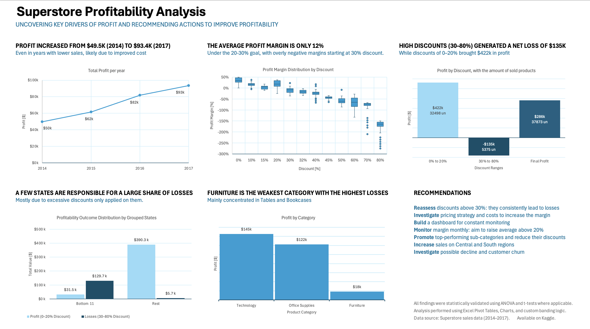

# Superstore Profitability Analysis
Excel-based retail profitability analysis identifying loss patterns and strategic improvement areas.

Created by: Marcus Fernandes.

This project analyzes the profitability of a fictional superstore using real sales data (from Kaggle). It identifies patterns in profit, discount strategy, and product performance across time, region, and category.

## 🔍 Key Insights

- **Profit Margin is Low (12%)**, below retail benchmark (20–30%)
- **High Discounts (30–80%)** lead to consistent losses — $135k in total
- **Central Region** is unprofitable (avg. margin = –10%)
- **Furniture Category** has the lowest margin (4%) and highest losses
- Profit increased from **$49.5k (2014)** to **$93.4k (2017)**, likely due to better cost control

## 📌 Recommendations

- Reassess and limit high discounts
- Increase margin consistency
- Focus on improving performance in Central region and Furniture category
- Monitor profit margins monthly

## 📊 Profitability Analysis Summary

## 📈 Methods Used

- Excel: Functions, Pivot Tables, and Charts
- Custom Banding for Segment Analysis
- Descriptive Statistics and Statistical Validation

## 📁 Files

- `Superstore Analysis Project MF.xlsx` — Full dataset, visualizations, and calculations
- `Profitability Analysis Summary.pdf` — Executive Summary

## 📎 Dataset

- Source: [Kaggle – Superstore Dataset](https://www.kaggle.com/datasets/vivek468/superstore-dataset-final)

---

💡 This project was built entirely in Excel as part of a data analysis learning path.
